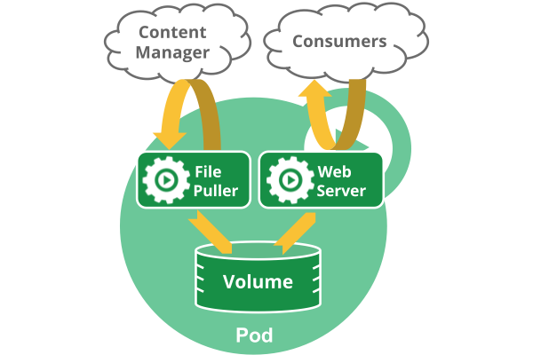

# 资源对象

## 理解 Kubernetes 中的对象

在 Kubernetes 系统中，*Kubernetes 对象* 是持久化的条目。Kubernetes 使用这些条目去表示整个集群的状态。特别地，它们描述了如下信息：

- 什么容器化应用在运行（以及在哪个 Node 上）
- 可以被应用使用的资源
- 关于应用如何表现的策略，比如重启策略、升级策略，以及容错策略

### 对象 Spec 与状态

每个 Kubernetes 对象包含两个嵌套的对象字段，它们负责管理对象的配置：对象 *spec* 和 对象 *status*。*spec* 必须提供，它描述了对象的 *期望状态*—— 希望对象所具有的特征。*status* 描述了对象的 *实际状态*，它是由 Kubernetes 系统提供和更新。在任何时刻，Kubernetes 控制平面一直处于活跃状态，管理着对象的实际状态以与我们所期望的状态相匹配。

### 描述 Kubernetes 对象

当创建 Kubernetes 对象时，必须提供对象的 spec，用来描述该对象的期望状态，以及关于对象的一些基本信息（例如，名称）。当使用 Kubernetes API 创建对象时（或者直接创建，或者基于`kubectl`），API 请求必须在请求体中包含 JSON 格式的信息。**更常用的是，需要在 .yaml 文件中为 kubectl 提供这些信息**。 

这里有一个 `.yaml` 示例文件，展示了 Kubernetes Deployment 的必需字段和对象 spec：

```yaml
apiVersion: apps/v1beta1
kind: Deployment
metadata:
  name: nginx-deployment
spec:
  replicas: 3 # 指定Pod副本数
  template: # 定义Pod模板
    metadata:
      labels:
        app: nginx
    spec:
      containers:
      - name: nginx
        image: nginx:1.7.9
        ports:
        - containerPort: 80
```

创建Deployment的方式如下：
```bash
$ kubectl create -f docs/user-guide/nginx-deployment.yaml --record
```

### 必需字段

在想要创建的 Kubernetes 对象对应的 `.yaml` 文件中，需要配置如下的字段：

- `apiVersion` - 创建该对象所使用的 Kubernetes API 的版本
- `kind` - 想要创建的对象的类型
- `metadata` - 帮助识别对象唯一性的数据，包括一个 `name` 字符串、UID 和可选的 `namespace`

也需要提供对象的 `spec` 字段。

## 理解 Pod

Pod 是 Kubernetes 中你可以创建和部署的最小也是最简的单位。Pod 代表着集群中运行的进程。

Pod 中封装着应用的容器（有的情况下是好几个容器），存储、独立的网络 IP，管理容器如何运行的策略选项。

> [Docker](https://www.docker.com/) 是 Kubernetes 中最常用的容器运行时，但是 Pod 也支持其他容器运行时。

在 Kubernetes 集群中 Pod 有如下两种使用方式：

- **一个 Pod 中运行一个容器**。最常见的用法.在这种使用方式中，你可以把 Pod 想象成是单个容器的封装，kuberentes 管理的是 Pod 而不是直接管理容器。
- **在一个 Pod 中同时运行多个容器**。高级用法。同一个 Pod 中的容器**共享资源、网络环境和依赖**，它们总是被同时调度。这些容器可以互相协作成为一个 service 单位 —— 一个容器共享文件，另一个“sidecar”容器来更新这些文件。Pod 将这些容器的存储资源作为一个实体来管理。



#### 网络

每个 Pod 都会被分配一个唯一的 IP 地址。Pod 中的所有容器共享网络空间，包括 IP 地址和端口。Pod 内部的容器可以使用 `localhost` 互相通信。Pod 中的容器与外界通信时，必须分配共享网络资源（例如使用宿主机的端口映射）。

#### 存储

可以为一个 Pod 指定多个共享的 Volume。Pod 中的所有容器都可以访问共享的 volume。Volume 也可以用来持久化 Pod 中的存储资源，以防容器重启后文件丢失。

如果 node 死掉了，分配到了这个 node 上的 pod，在经过一个超时时间后会被重新调度到其他 node 节点上。一个给定的 pod（如 UID 定义的）不会被“重新调度”到新的节点上，而是被一个同样的 pod 取代，如果期望的话甚至可以是相同的名字，但是会有一个新的 UID。

临时卷的生命周期跟 pod 相同，当 Pod 因为某种原因被删除或者被新创建的相同的 pod 取代时，pod 的附属物（例如 volume）也会被销毁和重新创建。

### Pod 和 Controller

Controller 可以创建和管理多个 Pod，提供副本管理、滚动升级和集群级别的自愈能力。例如，如果一个 Node 故障，Controller 就能自动将该节点上的 Pod 调度到其他健康的 Node 上。

## Pod phase

Pod 的 `status` 字段是一个 PodStatus 对象，PodStatus 中有一个 `phase` 字段。

Pod 的相位（phase）是 Pod 在其生命周期中的简单宏观概述。该字段并不是对容器或 Pod 的综合汇总，也不是为了做为综合状态机。

下面是 `phase` 可能的值：

- 挂起（Pending）：Pod 已被 Kubernetes 系统接受，但有一个或者多个容器镜像尚未创建。等待时间包括调度 Pod 的时间和通过网络下载镜像的时间，这可能需要花点时间。
- 运行中（Running）：该 Pod 已经绑定到了一个节点上，Pod 中所有的容器都已被创建。至少有一个容器正在运行，或者正处于启动或重启状态。
- 成功（Succeeded）：Pod 中的所有容器都被成功终止，并且不会再重启。
- 失败（Failed）：Pod 中的所有容器都已终止了，并且至少有一个容器是因为失败终止。也就是说，容器以非 0 状态退出或者被系统终止。
- 未知（Unknown）：因为某些原因无法取得 Pod 的状态，通常是因为与 Pod 所在主机通信失败


## 容器探针

探针是由 kubelet 对容器执行的定期诊断。要执行诊断，kubelet 调用由容器实现的 [Handler](https://godoc.org/k8s.io/kubernetes/pkg/api/v1#Handler)。有三种类型的处理程序：

- ExecAction：在容器内执行指定命令。如果命令退出时返回码为 0 则认为诊断成功。
- TCPSocketAction：对指定端口上的容器的 IP 地址进行 TCP 检查。如果端口打开，则诊断被认为是成功的。
- HTTPGetAction：对指定的端口和路径上的容器的 IP 地址执行 HTTP Get 请求。如果响应的状态码大于等于 200 且小于 400，则诊断被认为是成功的。

每次探测都将获得以下三种结果之一：

- 成功：容器通过了诊断。
- 失败：容器未通过诊断。
- 未知：诊断失败，因此不会采取任何行动。

Kubelet 可以选择是否执行在容器上运行的两种探针执行和做出反应：

- `livenessProbe`：指示容器是否正在运行。如果存活探测失败，则 kubelet 会杀死容器，并且容器将受到其 [重启策略](https://kubernetes.io/docs/concepts/workloads/pods/pod-lifecycle/#restart-policy) 的影响。如果容器不提供存活探针，则默认状态为 `Success`。
- `readinessProbe`：指示容器是否准备好服务请求。如果就绪探测失败，端点控制器将从与 Pod 匹配的所有 Service 的端点中删除该 Pod 的 IP 地址。初始延迟之前的就绪状态默认为 `Failure`。如果容器不提供就绪探针，则默认状态为 `Success`。

## 重启策略

PodSpec 中有一个 `restartPolicy` 字段，可能的值为 Always、OnFailure 和 Never。默认为 Always。 `restartPolicy` 适用于 Pod 中的所有容器。`restartPolicy` 仅指通过同一节点上的 kubelet 重新启动容器。失败的容器由 kubelet 以五分钟为上限的指数退避延迟（10 秒，20 秒，40 秒…）重新启动，并在成功执行十分钟后重置。如 Pod 文档 中所述，一旦绑定到一个节点，Pod 将永远不会重新绑定到另一个节点。

## Pod 的生命

一般来说，Pod 不会消失，直到人为销毁他们。这可能是一个人或控制器。这个规则的唯一例外是成功或失败的 `phase` 超过一段时间（由 master 确定）的 Pod 将过期并被自动销毁。

有三种可用的控制器：

- 使用 [Job](https://kubernetes.io/docs/concepts/jobs/run-to-completion-finite-workloads/) 运行预期会终止的 Pod，例如批量计算。Job 仅适用于重启策略为 `OnFailure` 或 `Never` 的 Pod。
- 对预期不会终止的 Pod 使用 [ReplicationController](https://kubernetes.io/docs/concepts/workloads/controllers/replicationcontroller/)、[ReplicaSet](https://kubernetes.io/docs/concepts/workloads/controllers/replicaset/) 和 [Deployment](https://kubernetes.io/docs/concepts/workloads/controllers/deployment/) ，例如 Web 服务器。ReplicationController 仅适用于具有 `restartPolicy` 为 Always 的 Pod。
- 提供特定于机器的系统服务，使用 [DaemonSet](https://kubernetes.io/docs/concepts/workloads/controllers/daemonset/) 为每台机器运行一个 Pod。

## Pod Preset

想要让一批容器在启动的时候就注入一些信息，比如 secret、volume、volume mount 和环境变量，而又不想一个一个的改这些 Pod 的 template，这时候就可以用到 PodPreset 这个资源对象了。